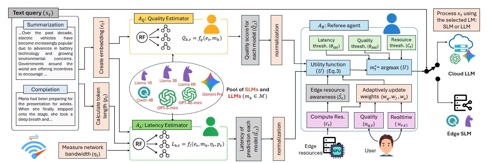

# EAFAL: Edge-Based Agentic Framework for LLM Selection

> 🚧 **Repository Status:**  
> This repository is currently under maintenance. Additional code, documentation, and experiments will be uploaded progressively.

---

## Introduction

This repository contains the official implementation of the **EAFAL** paper.

Generative AI increasingly relies on Large Language Models (LLMs). However, their high computational and storage requirements make deployment challenging in resource-constrained edge environments. Small Language Models (SLMs) provide faster and more privacy-preserving inference on edge devices, but often at the cost of reduced output quality.

Although previous studies have explored routing mechanisms between SLMs and LLMs to balance efficiency and accuracy, many existing approaches fail to jointly consider:

- Output quality
- Response latency
- User preferences
- Real-time edge resource constraints

In addition, many existing routing approaches rely on computationally expensive deep learning-based routers, which are impractical for lightweight edge environments.

To address these challenges, this work proposes **EAFAL**, an **Edge-Based Agentic Framework for LLM Selection** that jointly optimizes:

- Output quality
- Response latency
- Edge resource utilization

EAFAL employs three lightweight specialist agents that consider both:

- System factors such as available memory
- User requirements such as expected quality and latency

Using these factors, EAFAL selects the most suitable SLM or LLM for a given text query prior to inference.

Compared to existing approaches, EAFAL achieves:

- More effective SLM and LLM selection
- Significantly lower model selection time (`1.9 × 10⁻⁴ s`)
- 72.71% improvement in output quality
- 34.85% reduction in memory usage
- Average latency of 4.62 seconds

These results demonstrate the suitability of EAFAL for resource-aware and edge-driven Generative AI applications.

---

## Overview of the Methodology

The figure below illustrates the overall EAFAL framework and the agent-based decision process used for selecting between SLMs and LLMs under system and user constraints.



---

## Repository Contents

The repository will include:

- Source code for EAFAL
- Agent implementations
- Experimental setup
- Evaluation scripts
- Benchmark datasets
- Reproducibility instructions

---

## Citation

If you use this work in your research, please cite the corresponding paper.

```bibtex
@article{EAFAL2026,
  title={EAFAL: Edge-Based Agentic Framework for LLM Selection},
  author={...},
  journal={...},
  year={2026}
}
```

---

## Contact

For questions or collaborations, please contact the repository maintainers.